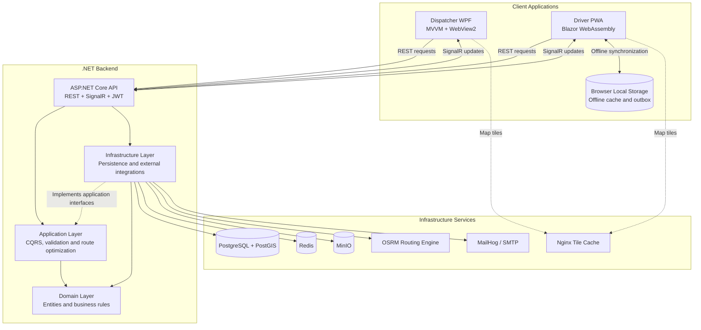

# Route Optimizer

## Overview

Route Optimizer is a delivery management system for dispatchers and drivers. A dispatcher
plans delivery routes from a set of orders, the system computes the optimal driving path,
and drivers follow their route on a phone while the dispatcher tracks progress in real time.

What it solves:

- Turn a list of orders into an efficient, ordered driving route instead of planning by hand.
- Give drivers a live route with stops, navigation and per order delivery actions.
- Let dispatchers see driver location, route status and delivery proof (photos) as it happens.

It has three parts:

- **API** (`RouteOptimizer.API`) backend on .NET 10, REST + SignalR realtime.
- **Dispatcher** (`RouteOptimizer.Dispatcher.Wpf`) Windows desktop app for dispatchers: build routes, assign drivers, watch progress on a map.
- **Driver PWA** (`RouteOptimizer.Driver.Pwa`) Blazor web app for drivers: follow the route, complete or skip stops, mark orders delivered, works offline.

## Architecture

Route Optimizer consists of two client applications connected to a shared .NET backend.

- The **Dispatcher WPF application** is used to create routes, assign drivers and monitor deliveries.
- The **Driver PWA** allows drivers to view routes, update stop statuses, upload delivery proof and continue working offline.
- The **ASP.NET Core API** provides REST endpoints, authentication and real-time updates through SignalR.
- The backend follows **Clean Architecture**, separating business rules, application logic, infrastructure and presentation concerns.



### Main data flow

1. A dispatcher selects delivery orders and requests route generation.
2. The backend obtains road distance and travel-time data from OSRM.
3. The application layer creates an optimized stop order.
4. The generated route is stored in PostgreSQL and assigned to a driver.
5. The driver receives the route through the PWA.
6. Driver location and delivery status changes are sent to the dispatcher in real time through SignalR.
7. When the driver is offline, actions are stored locally and synchronized after the connection is restored.

### Project structure

```text
src/
├── RouteOptimizer.Domain
│   └── Domain entities, value objects and business rules
│
├── RouteOptimizer.Application
│   └── CQRS handlers, validation, use cases and interfaces
│
├── RouteOptimizer.Infrastructure
│   └── Database access and external service implementations
│
├── RouteOptimizer.API
│   └── REST API, authentication, middleware and SignalR hubs
│
├── RouteOptimizer.Dispatcher.Wpf
│   └── Windows desktop application for dispatchers
│
└── RouteOptimizer.Driver.Pwa
    └── Blazor WebAssembly PWA for drivers
```

## Tech stack

**Backend (.NET 10)**

- Clean Architecture split into Domain, Application, Infrastructure and API layers.
- **MediatR** for CQRS command and query handlers, **FluentValidation** for input validation.
- **Entity Framework Core** with **Npgsql** over **PostgreSQL + PostGIS** for relational and geospatial data.
- **OSRM** as the routing engine that computes distances and the optimal stop order.
- **Redis** for caching and request idempotency.
- **MinIO** (S3 compatible) for storing delivery proof photos.
- **SignalR** for realtime driver location and route status updates.
- **JWT** authentication with refresh tokens, password reset and driver invitations; passwords hashed with **Argon2** (Konscious).
- **MailKit / MimeKit** for transactional email, **MailHog** as the local SMTP inbox.
- **Serilog** for structured logging, **Scalar** for API docs.

**Dispatcher (WPF)**

- .NET 10 WPF desktop app using **CommunityToolkit.Mvvm** (MVVM pattern).
- **WebView2** to embed the interactive map, **SignalR client** for live updates.

**Driver app (Blazor WebAssembly PWA)**

- Installable PWA with a service worker for **offline support**.
- **Blazored.LocalStorage** for an offline cache and an outbox that syncs actions when back online.
- **SignalR client** for realtime updates.

**Infrastructure**

- **Docker Compose** orchestrates PostgreSQL/PostGIS, Redis, MinIO, OSRM, MailHog and an nginx tile cache.

## Requirements

- Docker + Docker Compose
- .NET 10 SDK (only needed to run the WPF dispatcher)
- Windows (only for the WPF dispatcher; backend and PWA are cross platform)

## 1. Configure secrets

Create a `.env` file in the repo root:

```env
POSTGRES_USER=postgres
POSTGRES_PASSWORD=<your-password>
MINIO_ROOT_USER=minioadmin
MINIO_ROOT_PASSWORD=<your-password>
JWT_SECRET_KEY=<random-base64-secret>
```

Generate a JWT secret:

```bash
openssl rand -base64 32
```

## 2. Build the routing map (one time)

Downloads and processes the OSRM map (Poland by default). Run once before the first start:

```bash
docker volume create routeoptimizer_osrm_data
docker compose --profile init up osrm-download osrm-init
```

This step is slow and only needs to be repeated if you delete the `routeoptimizer_osrm_data` volume.

## 3. Start the backend and Driver PWA

```bash
docker compose up -d
```

- API: http://localhost:8080 (health: http://localhost:8080/health)
- Driver PWA: http://localhost:5080
- MinIO console: http://localhost:9001
- MailHog inbox: http://localhost:8025

## Default accounts (for review)

On first start in Development the API seeds a warehouse, a vehicle, sample orders and
three users (only if the database has no users yet). All of them share the same password:

| Role       | Email                   | Password       | Where to use |
|------------|-------------------------|----------------|--------------|
| Manager    | `manager@route.local`   | `Password123!` | API / admin tasks |
| Dispatcher | `dispatcher@route.local`| `Password123!` | Dispatcher (WPF) |
| Driver     | `driver@route.local`    | `Password123!` | Driver PWA (http://localhost:5080) |
| Driver     | `driver2@route.local`   | `Password123!` | Driver PWA (http://localhost:5080) |

Seeding only runs when `ASPNETCORE_ENVIRONMENT=Development` (the default in
`docker-compose.yml`) and is skipped once any user exists, so it is safe to restart.

## 4. Run the Dispatcher (WPF)

The desktop app connects to the API, so the backend must be running first.

```bash
dotnet run --project src/RouteOptimizer.Dispatcher.Wpf
```

It reads `src/RouteOptimizer.Dispatcher.Wpf/appsettings.json` for the API and map URLs (defaults to `http://localhost:8080` and `http://localhost:5000`).

To produce a standalone executable:

```bash
dotnet publish src/RouteOptimizer.Dispatcher.Wpf -c Release -r win-x64 --self-contained true
```

## Ports

| Service        | Port  |
|----------------|-------|
| API            | 8080  |
| Driver PWA     | 5080  |
| OSRM           | 5000  |
| PostgreSQL     | 5433  |
| Redis          | 6380  |
| MinIO API      | 9000  |
| MinIO console  | 9001  |
| MailHog SMTP   | 1025  |
| MailHog UI     | 8025  |
| Tile cache     | 8081  |

## Tests

```bash
dotnet test
```

## Stop

```bash
docker compose down
```
